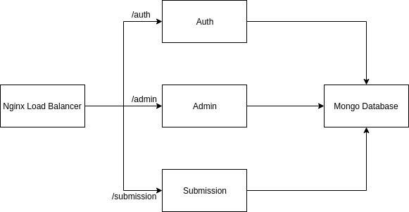

# Enigma Microservices
"Enigma" (by IEEE-VIT) implemented as a microservices architecture using Golang

> Note : This project is still in a development phase and was implemented as an experiment. This may not be used in production.

## Architecture


## Production Setup
To serve the application, follow the steps:

* Clone the repository

  ```
  $ git clone https://github.com/mayankshah1607/Enigma-Microservices.git
  ```
  
* ```
  $ cd Enigma-Microservices
  ```
  
 * Make sure you have [Docker](https://docs.docker.com/v17.09/engine/installation/) and [docker-compose](https://docs.docker.com/compose/install/) set up before executing the next command :
 
    ```
    $ docker-compose up --build
    ```

## Development Setup
To develop this project, simply clone it and `cd` into the root directory. Open your favourite text editor and start coding!

## API Documentation
### Admin
This route creates a new Question in the database
`POST /admin/submit`
```
Request Body => JSON({
    text: String, 
    image_url: String,
    answer: String
   })
